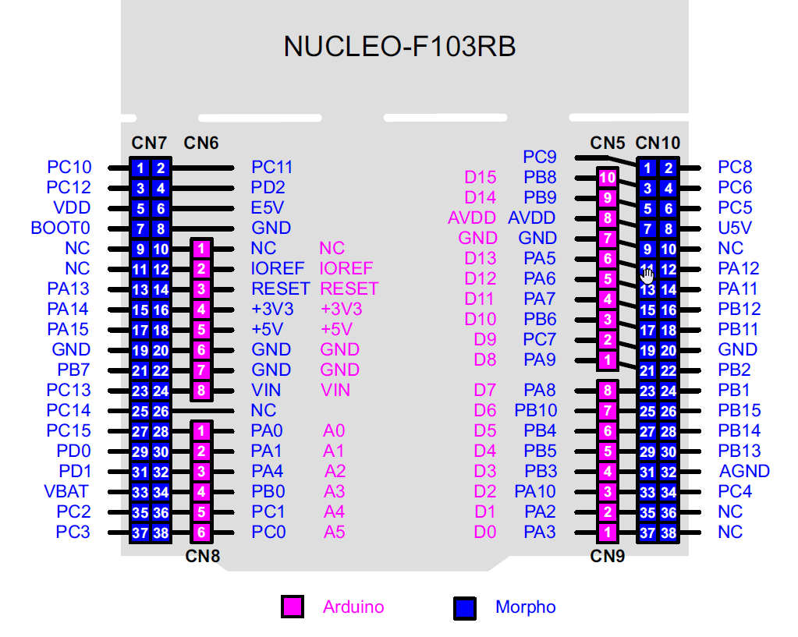

## miscellaneous

1. NUCLEO-F103RB pin map

from: Figure 14, 6.10 Extension connectors, [STM32 Nucleo-64 Board User Manual(UM1724)](https://www.st.com/resource/en/user_manual/um1724-stm32-nucleo64-boards-mb1136-stmicroelectronics.pdf), rev11, November 2016)

