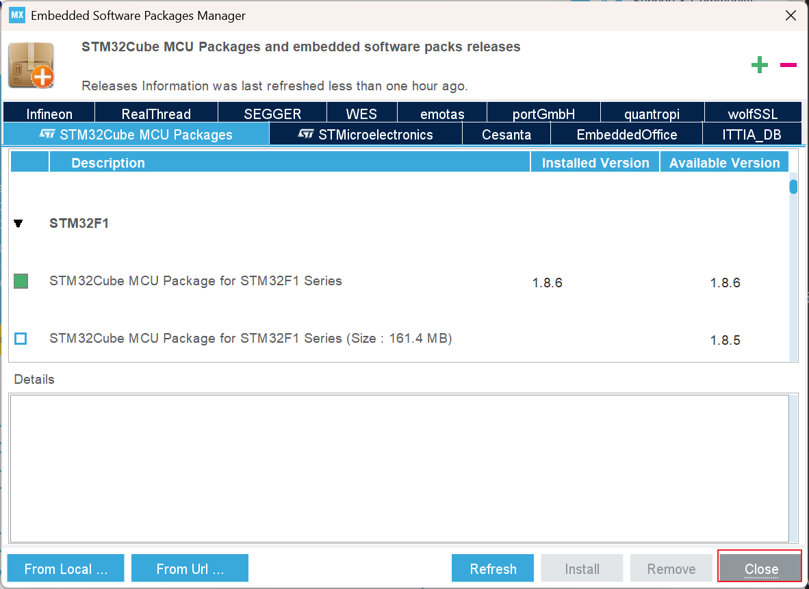

# 실습환경 

**OS** MS-Windows 11(x64)

**Target** STM32 NUCLEO F103RB
 - STMF103RBT6 MCU 사용

**IDE** STM32 Cube IDE 1.18.0 (2025년 3월 현재)
 - STMicronics에서 제공하는 Eclipse기반의 MCU 개발IDE
 - Mac, Linux 용 제공됨

# 1. 다운로드 및 설치
 - 구글/네이버 등에서 *stm32cubeide download* 로 검색해서 st.com사이트의 STM32CubeIDE 다운로드 페이지에서 STM32CubeIDE를 받아 설치한다.

 - 다운로드 받기 위해 myST 계정을 새로 생성 또는 로그인하라는 화면이 나온다. 원한다면 로그인 없이 Guest로 다운로드 할 수 있지만, 이후의 CubeIDE 및 Embedded Software(Firmware & Software, 구 MX Update) 업데이트 과정에서 어차피 myST로그인이 필요하므로 myST 계정을 생성하거나 로그인 하는 것이 좋다

# 2. S/W 및 firmware 업데이트

## 2-1. CubeIDE 업데이트
 Help > Check For Updates 를 클릭하여 업데이트할 신버전이 있는 지 체크한다.

## 2-2. firmware (Embedded Software) 업데이트
 사용할 보드를 위한 Embeded software를 다운로드/업데이트하는 과정임

### 2-2-1. Help > Configuration Tool > Manage Embedded Software Packages 를 선택

### 2-2-2.  Nucleo-64 STMF103RB보드의 MCU인 STM32F1을 클릭해서 펌웨어 버전 확인

### 2-2-3. 25년 3월 기준 최신버전인 1.8.6 버전을 체크하여 선택하고, 하단의 Install 버튼을 클릭

### 2-2-4. myST 계정 정보 요구

### 2-2-5. STM32CubeIDE다운로드시에 생성한 myST 계정 정보를 입력한다. 만일 Guest로 다운로드 했었다면 이번에 myST 계정을 새로 생성한다

### 2-2-6. 다운로드 진행 화면

### 2-2-7. 다운로드가 끝나면 하단의 Close 버튼을 누른다

# 3. 새 프로젝트 생성

## 3-1. 프로젝트 생성 메뉴 선택
**STM32CubeIDE** 실행 후, 아래와 같이 File - New - STM32 Project 선택 

### 3-2. Target 보드 선택

#### 3-2-1. 보드 셀렉터 메뉴
Tafget Selection 윈도우가 나타나면 **Board Selector** 탭을 클릭

### 3-2-2. Nucleo-64 F103RB 보드 선택
Board selector 탭의 Type에서 NUCLEO64를 체크, MCU/MPU Series에서 STM32F1을 체크 하면, 우측의 Board List에 **NUCLEO-F103RB**가 표시된다. 이 항목의 왼쪽칸의 별표를 클릭해서 즐겨찾기 등록을 하고 하단의 Next > 버튼을 클릭한다. 
- 즐겨찾기 등록을 하면 이후에 새 프로젝트 생성 시 보드를 일일이 검색하지 않고 바로 찾을 수 있다.

### 3-3. 프로젝트 이름(폴더명) 입력력
STM32 Project 창이 나타나면 Project Name: 에 적당한 프로젝트 이름을 입력 후(예: LED_Blink) Finish 버튼을 클릭한다. 
 - 여기서는 시험으료 000_test_project 라는 이름으로 생성하였다.

### 3-4. Board Project Options 
 디폴트 모드로 peripheral 설정을 하겠냐고 물어보는데, 처음배우는 동안에는 Yes 버튼을 클릭한다.

### 3-5. 프로젝트 생성 완료

아래와 같은 화면과 함께 프로젝트 파일들이 생성되고,

프로젝트 파일 생성이 끝나면 아래와 같은 pinout & configuraiton 화면이 나타난다. 이후에는 각 프로젝트에 필요한 MCU의 pin설정 및 clock설정등을 진행하게 된다. 이후 단계는 각 예제 프로젝트에서 설명.

