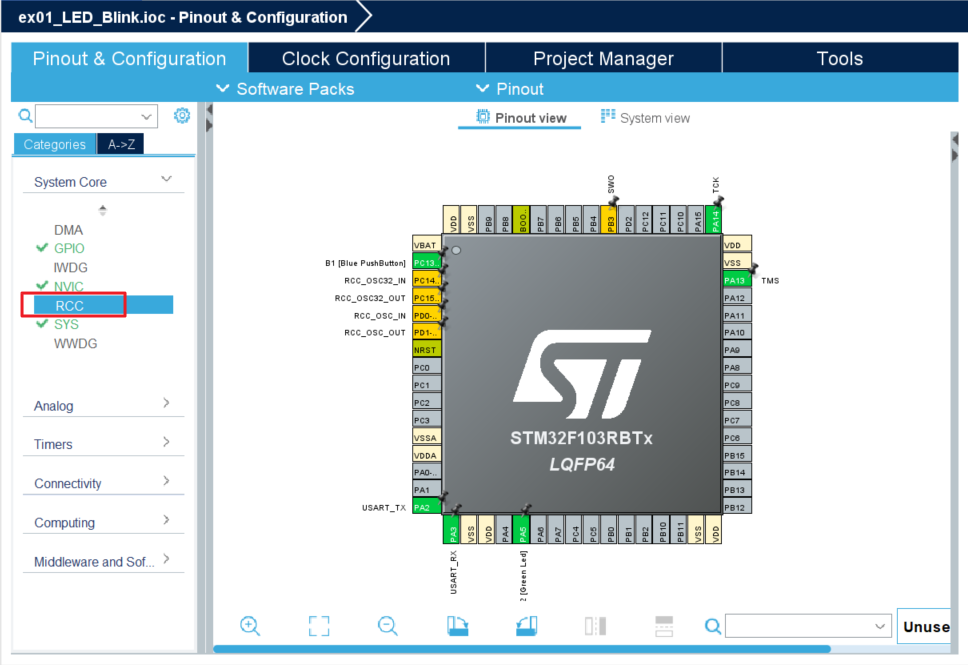

## LED_Blink

GPIO 출력 기능을 이용한 보드 내장 LED 제어 

#### 개발환경

**OS** MS-Windows 10, 11(64bit)

**Target보드** STM32 NUCLEO F103RB

**IDE** STM32CubeIDE 1.18.0

**참고문헌** STM32CubeIDE를 이용한 STM32 따라하기(주)북랩 김남수 ∙ 이진형 지음 

## 시작하기 전 유의사항
 몇 가지 사전 작업으로 STM32CubeIDE의 firmware업데이트 등을 해두면 이후 과정이 편해진다. ex00_EnvironmentSetting 항목을 확인하지 않았다면 확인 후 진행하는 것을 권장.

### 1. 프로젝트 생성

**STM32CubeIDE** 실행 후, 아래와 같이 File - New - STM32 Project 선택 


#### 1-1. Target Board 선택

Target Selection 윈도우가 나타나면 **Board Selector** 탭을 클릭


Board selector 탭의 Type에서 NUCLEO64를 체크,


 MCU/MPU Series에서 STM32F1을 체크 하면 Board List에 **NUCLEO-F103RB**가 표시된다.  이를 선택 후, 하단의 Next > 버튼을 클릭한다.
 


#### 1-2. Project Name 결정

STM32 Project 창이 나타나면 Project Name: 에 적당한 프로젝트 이름을 입력 후(예: LED_Blink) Finish 버튼을 클릭한다. 


Board Project Options 대화창에서 Yes 버튼을 클릭한다.


### 2. 장치 설정
#### 2-1. Device Configuration Tool

이 기능은 보드의 마이크로 콘트롤러(여기서는 ST F103RB)칩의 pin, clock 및 HAL관련 자동코드 생성 및 등을 설정하는 부분이라고 한다. 이전에는 STM32CubeMX 라는 tool로 제공되던 기능이라고 하던데, 2025년 STM32CubeIDE 1.18.0버전에서는 CubeIDE에 통합되어 제공되는 기능이다.
(ref: UM2609 매뉴얼의 chapter 1.4.1.3)

상세한 것은 점차 익혀하고, 지금은 최소한의 설정만으로 진행한다.

화면이미지 좌측의 **System Core**를 클릭한다.


- **RCC 설정**

RCC 설정을 위해 다음 그림과 같이 System Core 하위 메뉴중 RCC를 클릭한다.




중앙부분의 RCC Mode and Configuration 의 Mode에서서 High Speed Clock(HSE), Low Speed Clock(LSE) 모두 Disable로 변경한다.


- **GPIO 확인**

  이번에는 설정변경없이 디폴트 설정으로 LED2번을 사용할 것이므로, 아래 그림과 같이 좌측에서 System Core 하위 메뉴에서 GPIO를 선택한 후, 중앙부 하단의 Configuration 창에서 GPIO항목에 PA5, PC13 pin이 기존설정상태에서 표시되어있는 지 확인한다.


#### 2-2. Generate Code
  이상없으면,  
  지금까지의 설정을 반영한 코드 생성을 위해 Project 메sb > Generate Code 를 선택한다. 그러면 지금까지 진행한 RCC(clock) 및 GPIO 설정 내용이 반영된 코드(main.c 포함)가 자동생성된다.
  


### 3. Code 작성

#### 3-1. main.c의 outline 확인

프로젝트 생성 후, 최초로 Generate Code를 수행하면 다음과 같이 main.c 파일의 편집창이 열린다. 우측에는 main.c파일의 outline (헤더파일, 함수선언, 함수정의 등이 표시)이 표시될 것이다. 이것은 우측 상단에서  C/C++를 위한 Perspective가 설정되어서 그런데, 이것은 STM32CubeIDE의 베이스Tool인 Eclipse의 기능이다. 자세한 것은 별도로 검색/구글링 해서 찾아보면 될 것 같다.


일단 이번 프로젝트에서는 Nucleo보드의 내장 LED를 깜박거리게 하는 것을 해볼 것이므로, 해당 작업을 위한 최소한의 코딩과 설명만 진행할 것이다.

#### 3-2. main.c의 에서 코드 작성 및 빌드 확인
96 ~ 104행의 다음 코드를

```c
  /* Infinite loop */
  /* USER CODE BEGIN WHILE */
  while (1)
  {
    /* USER CODE END WHILE */

    /* USER CODE BEGIN 3 */
  }
  /* USER CODE END 3 */
```

아래와 같이 수정한다.

```c
  /* Infinite loop */
  /* USER CODE BEGIN WHILE */
  while (1)
  {
    HAL_GPIO_TogglePin(LD2_GPIO_Port, LD2_Pin);
    HAL_Delay(1000);
    /* USER CODE END WHILE */

    /* USER CODE BEGIN 3 */
  }
  /* USER CODE END 3 */
```

그리고 

Project 메뉴의 Build Project를 선택하여 빌드한다. 

아래와 같이 Error(에러), Warning(경고) 없이 빌드되었는 지 확인하고, 에러나 경고가 있을 경우 해당 부분을 찾아서 코드를 수정하도록 한다. 


#### 3-2. 작성한 코드를 Nucleo보드로 전송 및 실행

에러와 경고없이 빌드되었다면, Nucleo보드를 USB케이블을 이용해 작업중인 PC에 연결한다. 

정상적으로 연결이 되었다면 Nucleo보드의 LED에 불이 들어올 것이다.


보드가 PC에 USB케이블로 연결되고 전원이 들어온 상태에서 Run 메뉴 > Run을 선택한다.


해당프로젝트에서 처음으로 Run을 할 시에 Release용인지 Debug용인지 선택하는 화면이 나온다. 여기서는 그냥 하단의 OK를 클릭한다.


이후 진행은 하단의  Console창에서 nucleo보드와 통신연결을 하면서 빌드된 프로그램을 전송하는 과정이 진행된다.


모든 전송이 끝나면, 아래의 사진 및 동영상과 같이 타겟보드의 녹색 LED (기판을 확인하면 LD2라고 쓰여있다)가 1초 간격으로 점멸하는 것을 볼 수 있다.


https://github.com/user-attachments/assets/4a0a8335-bd84-4819-9d7a-49460f6f13c4


[**목차**](../README.md) 
