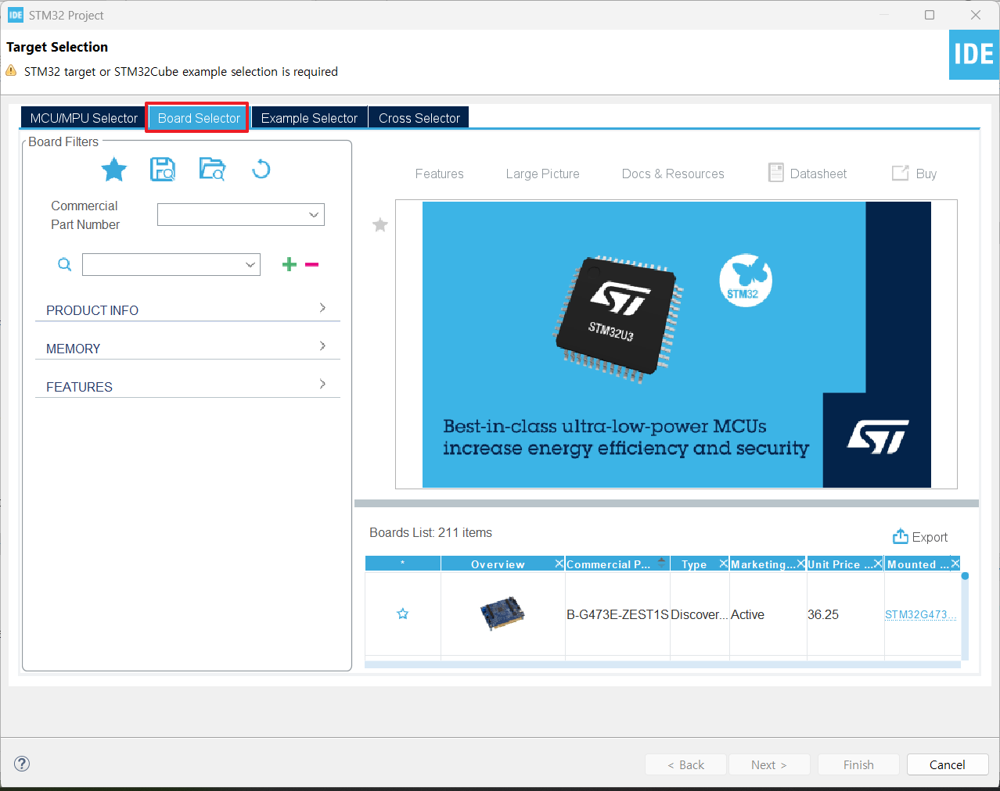
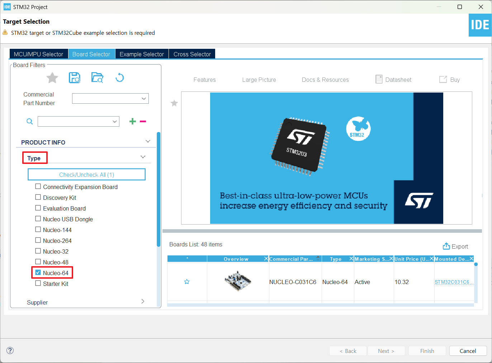
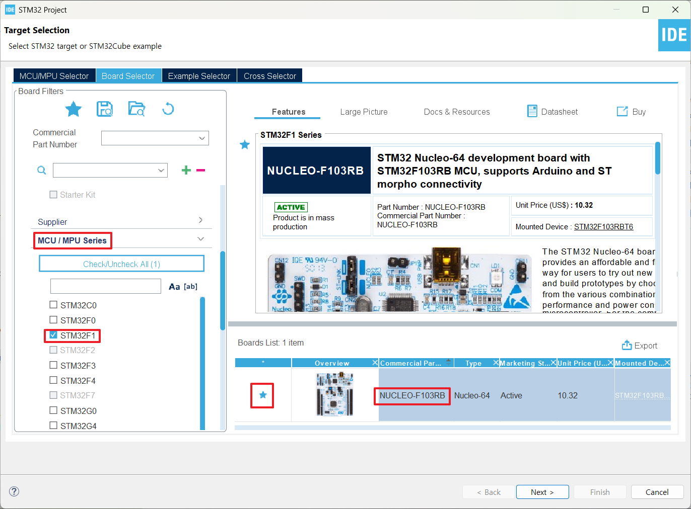
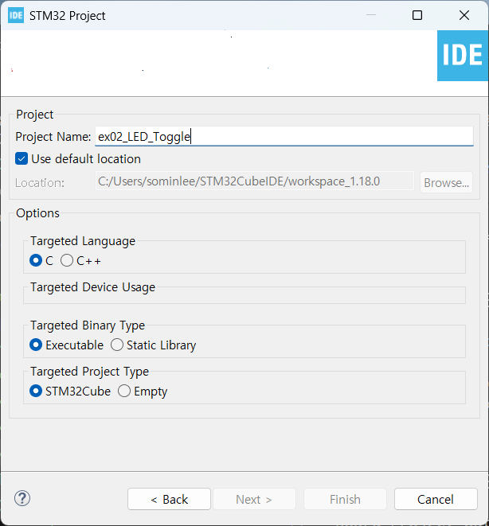
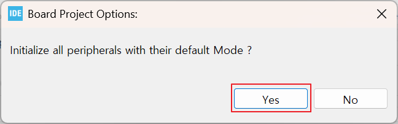
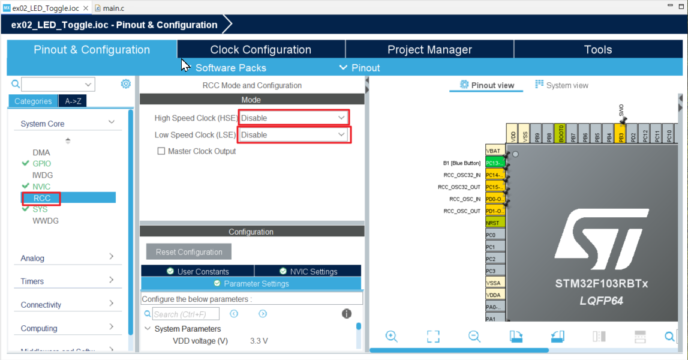
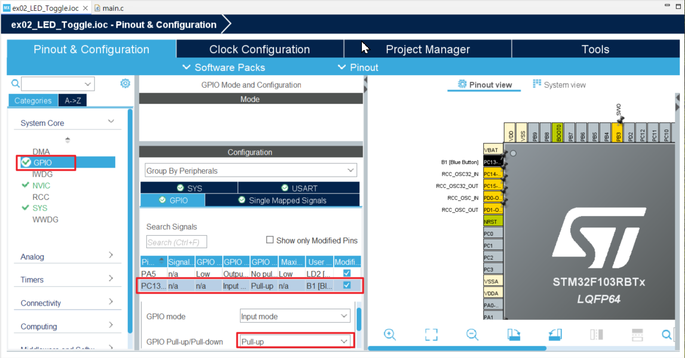
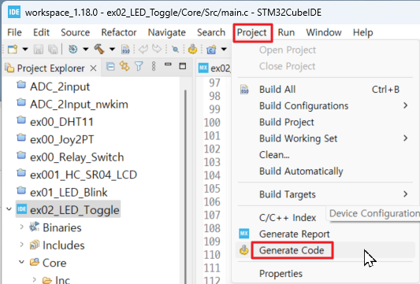

## LED_Toggle

GPIO 입력 기능(파란색 버튼)을 이용한 보드 내장 LED 제어 

#### 개발환경

**OS** MS-Windows 10, 11(64bit)

**Target보드** STM32 NUCLEO F103RB

**IDE** STM32CubeIDE 1.18.0

**참고문헌** STM32CubeIDE를 이용한 STM32 따라하기(주)북랩 김남수 ∙ 이진형 지음 

### 1. 프로젝트 생성

**STM32CubeIDE** 실행 후, 아래와 같이 File - New - STM32 Project 선택 


#### 1-1. Target Board 선택

Target Selection 윈도우가 나타나면 **Board Selector** 탭을 클릭




Board selector 탭의 Type에서 NUCLEO64를 체크,


 MCU/MPU Series에서 STM32F1을 체크 하면 Board List에 **NUCLEO-F103RB**가 표시된다.  이를 선택 후, 하단의 Next > 버튼을 클릭한다.
 


#### 1-2. Project Name 결정

STM32 Project 창이 나타나면 Project Name: 에 프로젝트 이름을 입력 후 Finish 버튼을 클릭한다. 



Board Project Options 대화창에서 Yes 버튼을 클릭한다.




Open Associated Perspective 대화창에서 Yes 버튼을 클릭하면 Device Configration Tool 창이 열린다.

### 2. 장치 설정
#### 2-1. Device Configuration Tool

- **RCC 설정**

RCC 설정을 위해 다음 그림과 같이 System Core 하위 메뉴중 RCC를 클릭한다.

중앙부분의 RCC Mode and Configuration 의 Mode에서서 High Speed Clock(HSE), Low Speed Clock(LSE) 모두 Disable로 변경한다.




- **GPIO 확인**

GPIO항목에서 PC13번을 pull_up으로 변경한다.



#### 2-2. Generate Code
  설정을 반영한 코드 생성을 위해 Project 메sb > Generate Code 를 선택한다. 
  


### 3. Code 작성

#### 3-1. main.c의 에서 코드 작성 및 빌드 확인
45 ~ 48행에 다음 코드를 입력

```c
/* USER CODE BEGIN PV */
int debounce_delay = 180;
int led_state  = 0;
/* USER CODE END PV */
```

98행~114행의 /* USER CODE BEGIN WHILE */ ~  /* USER CODE BEGIN 3 */ 사이를 아래와 같이 수정한다.

```c
  /* USER CODE BEGIN WHILE */
  while (1)
  {
    if (HAL_GPIO_ReadPin(B1_GPIO_Port, B1_Pin) == GPIO_PIN_RESET)
    {
      HAL_Delay(debounce_delay);
      if (HAL_GPIO_ReadPin(B1_GPIO_Port, B1_Pin) == GPIO_PIN_RESET)
      {
        led_state = led_state ^ 1;
        HAL_GPIO_WritePin(LD2_GPIO_Port, LD2_Pin, led_state);
      }
      HAL_Delay(debounce_delay);
    }
    /* USER CODE END WHILE */

    /* USER CODE BEGIN 3 */
  }
```

그리고 

Project 메뉴의 Build Project를 선택하여 빌드한다. 

#### 3-2. 작성한 코드를 Nucleo보드로 전송 및 실행

에러와 경고없이 빌드되었다면, Nucleo보드를 USB케이블을 이용해 작업중인 PC에 연결한다. 

정상적으로 연결이 되었다면 Nucleo보드의 LED에 불이 들어올 것이다.

보드가 PC에 USB케이블로 연결되고 전원이 들어온 상태에서 Run 메뉴 > Run을 선택한다.

Nucleo보드에 프로그램이 업로드된 이후 파란색 버튼을 살짝 눌렀다 떼면 아래의 동영상에서 처럼 LD2 LED에 불이 켜졌다 꺼졌다 할 것이다.

https://github.com/user-attachments/assets/27b4c042-9261-4a38-8dd8-d976da714cb0

[**목차**](../README.md) 
